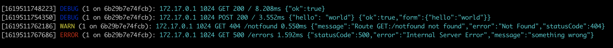

# fastify-api-logger

[](https://standardjs.com/)

Simple and straightforward API request/response single line data logging for Fastify.

## Install

`npm install --save fastify-api-logger`

## Usage

```js
const fastify = require('fastify')

fastify.register(require('fastify-api-logger'))
```

## Demo



## License

Licensed under [MIT](./LICENSE)
